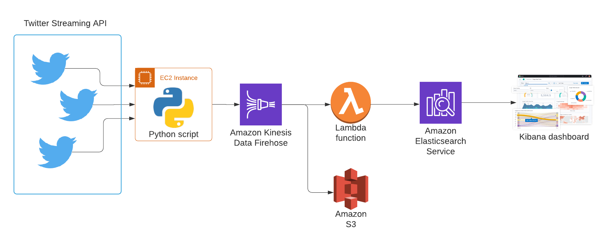

# Cats v Dogs - Visualising Twitter popularity in real-time with AWS data streaming tools

## Project Summary

The goal of this project was to learn the fundamental components of a data streaming pipeline by finding a simple, highly abstracted cloud-based method to analyse & visualise a data stream
in real-time.

The application aims to analyse the popularity of cats and dogs on Twitter at any particular point in time and visualise its evolution in real-time on a dashboard. Popularity is judge simply by the number of tweets coming through with cat or dog related hashtags.

This first implementation was kept as simple as possible as a proof-of-concept of the end-to-end pipeline and further complexity will be added to the application gradually. For example:
- Additional analysis in-stream (including a more accurate determination of popularity using the number of likes or retweets)
- Exploring the full capabilities of Elasticsearch & Kibana for more sophisticated analytics and visualisations (e.g. highlighting the most popular Tweet of the hour, text field reacting to the data evolution in real-time etc...)
- Including a call to an ML model to determine positive or negative sentiment of each streamed Tweet

## Repository contents

- **aws_resources_template.py** - template to provision an AWS S3 Bucket and Firehose Delivery Stream using Infrastructure as Code. 
- **credentials_template.py** - template of AWS credentials to be included in the project in order for the code to function correctly.
- **twitter_stream.py** - Python script that connects to the Twitter API, streams live Tweet records and pushes them to the delivery stream
- **in_stream_lambda_handler.py** - Lambda function that processes records in-stream. This needs to be imported or copied into the Lambda configuration in the AWS Console.
- **requirements.txt** - contains all the Python packages to be included in the environment configuration.
- **Data Science & Engineering Club - 24th July 2021 - Presentation.pdf** - Slides for the presentation of the project given at the Data Science & Engineering Club. Contains more detail about each component of the architecture as well as issues encountered in the process.
   
## Architecture

