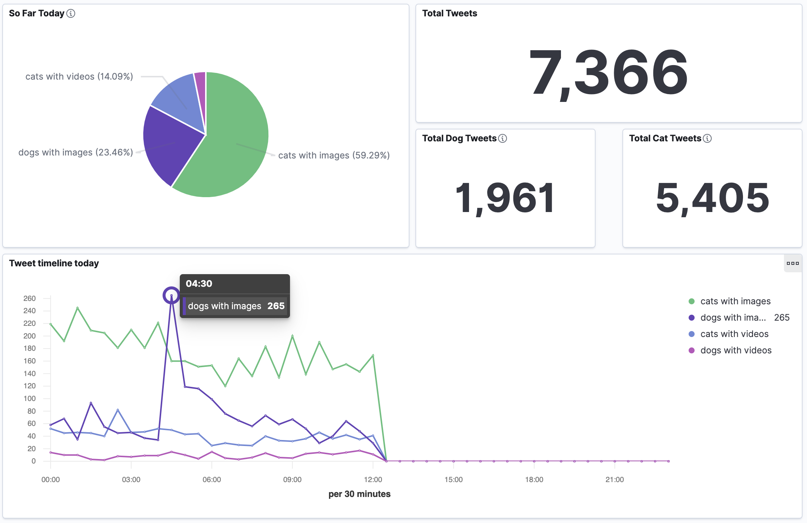

# Cats v Dogs - Visualising Twitter popularity in real-time with AWS data streaming tools

## Project Summary

The goal of this project was to learn the fundamental components of a data streaming pipeline by finding a simple, highly abstracted cloud-based method to analyse & visualise a data stream
in real-time.

The application aims to analyse the popularity of cats and dogs on Twitter at any particular point in time and visualise its evolution in real-time on a dashboard. Popularity is judge simply by the number of tweets coming through with cat or dog related hashtags.

This first implementation was kept as simple as possible as a proof-of-concept of the end-to-end pipeline and further complexity will be added to the application gradually. For example:
- Additional analysis in-stream (including a more accurate determination of popularity using the number of likes or retweets)
- Exploring the full capabilities of Elasticsearch & Kibana for more sophisticated analytics and visualisations (e.g. highlighting the most popular Tweet of the hour, text field reacting to the data evolution in real-time etc...)
- Including a call to an ML model to determine positive or negative sentiment of each streamed Tweet

## Repository contents

- **aws_resources_template.py** - template to provision an AWS S3 Bucket and Firehose Delivery Stream using Infrastructure as Code. 
- **credentials_template.py** - template of AWS credentials to be included in the project in order for the code to function correctly.
- **twitter_stream.py** - Python script that connects to the Twitter API, streams live Tweet records and pushes them to the delivery stream
- **in_stream_lambda_handler.py** - Lambda function that processes records in-stream. This needs to be imported or copied into the Lambda configuration in the AWS Console.
- **requirements.txt** - contains all the Python packages to be included in the environment configuration.
- **Data Science & Engineering Club - 24th July 2021 - Presentation.pdf** - Slides for the presentation of the project given at the Data Science & Engineering Club. Contains more detail about each component of the architecture as well as issues encountered in the process and estimated implementation costs.
   
## Architecture

### Producer script

The Python script serves two main purposes:
   - It connects to the Twitter API to set the rules that specify which Tweets will be streamed. The stream will only include Tweets with hashtags related to cats or dogs that also contain images or videos.
   - It then opens a persistent connection to the Twitter Filtered Stream API and ingests the streaming Tweet objects into the Firehose Delivery Stream. The fields contained in the Tweet objects are determined by the HTTP query parameter. In this particualr implementation, the following fields are included: Tweet Id, Retweet count, Reply count, Like count, Quote count, Tweet text (including hashtags), Matching rules id, Matching rules tag.

The script contains a loop to automatically reconnect if the stream is disconnected or encounters any exception such as unexpected record formats.

### AWS Firehose Delivery Stream + Lambda function

Kinesis Data Firehose is an AWS service that ingests, transforms and delivers data to a given destination, which in our case is an Elasticsearch analytics engine. It also delivers a back-up of each record to an S3 bucket.

The Lambda function processes each record as it goes through the stream. It cleans up each Tweet, keeping only the relevant fields for further analysis (the granularity of the Twitter query parameters allowed means that some fields are included by the Twitter API by default and need to be pruned to save on space and compute time). It also adds a timestamp and converts the record to JSON format (required for Elasticsearch) before pushing the record back into the Firehose stream for delivery to its destination.

### Elasticsearch + Kibana

Elasticsearch is a distributed, JSON-based search and analytics engine. The AWS ES service is a fully managed service to deploy and run an Elasticsearch cluster. The integration with Firehose in AWS is pretty seamless and the schema of the records is automatically recognised by ES and reflected into an ES index.

The real-time visualisation dashboard was created using Kibana, which comes built-in with Elasticsearch. It displays a number of metrics and updates automatically every 60 seconds.

